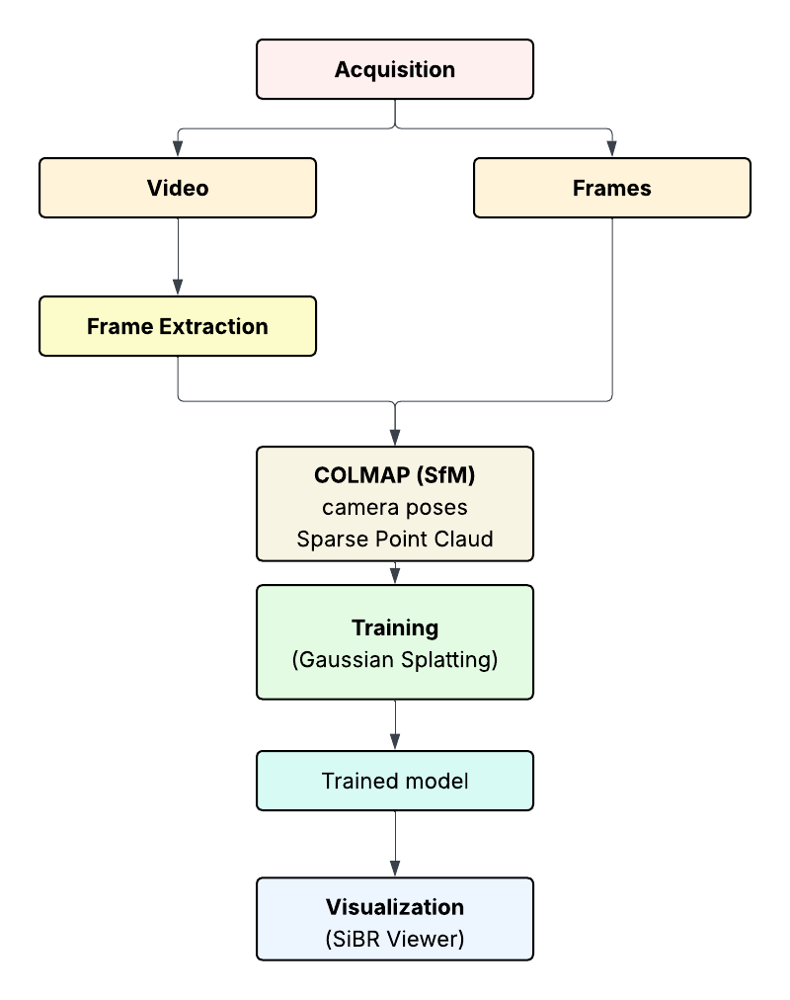

# 3D Gaussian Splatting for Real-Time Scene Reconstruction

## Overview

This project implements a full pipeline for **3D  scene reconstruction using 3D Gaussian Splatting**
The goald is to reconstruct a real-world scene from videos sequences by extracting frames, estimating camera poses using Structure-from-Motion, and rendering the result in real time using an explicit 3D Gaussian representation.
The implementation follows the method introduced in:

**3D Gaussian Splatting (Inria, 2023)** 
Repository: https://github.com/graphdeco-inria/gaussian-splatting

The data is acquired using a ZED stereo camera and processed through saveral stages including frame extraction, camera pose estimation, model training and visualization.
This approach enables high-quality novel view synthesis with real-time rendering performance.

---

## Project Pipeline

The proposed workflow converts raw data acquired with a ZED camera into a real-time 3D representation using Gaussian Splatting.
The complete reconstruction workflow consists of:

1. ZED Acquisition (`importpyzed.py`) 
2. Frame Extraction (`extract_frames.py`)  
3. Camera Pose Estimation (`convert.py`)  
4. Gaussian Splatting Training (`train.py`)  
5. Visualization (`gs_viewer.py`)  

### Pipeline Diagram

<p align="center">
  
</p>

---

## Optimizer

The optimizer uses PyTorch and CUDA extensions in a Python environment to produce trained models.

 ****Software Requirements****

- Conda (recommended for easy setup)
- C++ Compiler for PyTorch extensions (we used Visual Studio 2019 for Windows)
- CUDA SDK 11 for PyTorch extensions, install after Visual Studio (we used 11.8)
- C++ Compiler and CUDA SDK must be compatible


****Setup****

*Local Setup (Windows – x64)*

Before starting, open:

**"x64 Native Tools Command Prompt for Visual Studio"**

This ensures that the correct MSVC compiler and build tools are available for CUDA and PyTorch extensions.

---

## Clone the Repository

Run:

```bash
git clone https://github.com/tomasmendestt/Gaussian_splatting_application --recursive
cd gaussian-splatting
```

## Create the Conda Environment

Run:

```bash
conda env create --file environment.yml
conda activate gaussian_splatting
```

## Install the submodules

Run:

```bash
conda install -y -c conda-forge vs2015_runtime vc14_runtime
conda install -y -c conda-forge mkl intel-openmp
conda install -y -c pytorch pytorch=1.12.1 torchvision=0.13.1 torchaudio=0.12.1 cudatoolkit=11.6
```

Check with:
```bash
python -c "import torch; print(torch.__version__)"
```

If everything runs without a problem you can install the submodules one by one:

```bash
SET DISTUTILS_USE_SDK=1
pip install ninja
pip install -v -e submodules/simple-knn
pip install -v -e submodules/fused-ssim
pip install -v -e submodules/diff-gaussian-rasterization
```

---

## 1. ZED Acquisition

The input data used for the reconstruction was acquired using a **ZED stereo camera**.  
To perform the acquisition step, the camera must first be connected to the computer and the appropriate Python environment must be activated.

After that, run the acquisition script:

```bash
python importpyzed.py
```

The script allows the user to select one of two acquisition modes:
- Video mode: records a video sequence (.avi) for a user-defined duration.
-  Frame mode: captures a user-defined number of frames directly.

If the video mode is selected, the recorded video must later be converted into individual frames before continuing the pipeline.
The purpose of this step was to capture a sequence of views with sufficient overlap and viewpoint variation to enable reliable 3D reconstruction.

During acquisition, the camera was moved smoothly around the target scene while maintaining stable motion and good visibility of the scene structure.

Two acquisition strategies were used depending on the target:

- **Object acquisition:** the camera was moved around the object to capture it from multiple viewpoints.
- **Scene acquisition:** the camera was carried through the environment while maintaining continuous motion and covering the visible geometry.

<p align="center">
  
  
</p>
<p align="center">
  ZED acquisitions examples.
</p>

---

## 2. Frame Extraction

If the acquisition was performed in video mode, the recorded video must be converted into individual frames.
The video file must be saved inside the following directory structure:

data/crane/input_video.mp4

The frames should then be extracted inside the 'data/crane/' folder.

Run:

```bash
python extract_frames.py -i scene_name/data/crane/input_video.mp4 --fps 3
```

**Note: You should adjust fps in order to have arround 200-300 frames per video**
All images will then be saved inside 'scene_name/data/crane'

Recommended:
 - Images must be captured with camera motion (not rotating the object with a fixed camera)
 - Larger datasets increase processing time significantly
 - Save all images inside a folder and call it '/input'

If the frame mode was used during acquisition, this step is not necessary since the images are already captured individually.

---

## 3. Camera Pose Estimation 

Camera poses and sparse geometry are estimated using a Structure-from-Motion (SfM) approach.
They are obtained using COLMAP.
This step determines the position and orientation of each camera frame and generates a sparse point cloud of the scene.

Each scene must follow this structure:

```bash
<scene_name>/
│
├── input/
│   ├── 0001.png
│   ├── 0002.png
│
├── sparse/
│   └── 0/
│       ├── cameras.bin
│       ├── images.bin
│       ├── points3D.bin
```

This outputs are required for training the Gaussian Splatting model. It is a COLMAP-compatible sparse reconstruction.

This output is REQUIRED for the training step, as it provides:
- Camera poses (extrinsics)
- Camera intrinsics
- Sparse 3D structure

The training script directly reads this data from the `sparse/0` folder.

To perform the SfM run:

```bash
python convert.py -s path/to/dataset
```
---

## 4. Gaussian Splatting Training

The prepared dataset is used to traibn the Gaussian Splatting model.
The training process optimizes a set of 3D Gaussians that represent the geometry and appearance of the scene.
Training is executed using the following command:

```bash
python train.py -s path/to/dataset
```

The output structure must be:

```bash
<location>
│
└── output/
│     └── scene_name/
│        │
│        ├── point_cloud/
│        │      ├── interation_7000
│        │      │   └── point_cloud.ply
│        │      │
│        │      ├── interation_30000
│        │          └── point_cloud.ply
│        │
│        ├── cameras.json
│        │
│        ├── cfg_args
│        │
│        ├── exposure.json
│        │
│        ├── input.ply
```
---

## 5. Visualization

After training, the reconstructed scene can be visualized using SIBR viewer.
Run:

```bash
python gs_viewer.py -m output/scene_name/interaction_XXX
```

The viewer loads optimized 3D Gaussians, uses GPU rasterization, renders in real time and allow free camera navigation

---

## RESULTS

The pipeline produces a real-time 3D representation of captured scene.
The final output consists of a trained Gaussian model that can be rendered interactively using the viewer.


<p align="center">
  
  
</p>
<p align="center">
  Gaussian Splatting results.
</p>

---

## NOTES

Reconstruction quality depends heavily on acquisition quality.

The following factors my negatively affect results:

- motion blur
- poor lighting
- reflective surfaces
- low-texture areas

